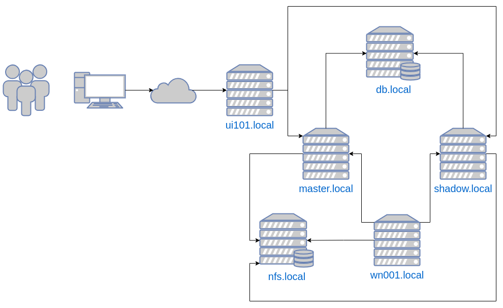

## Setting up a Slurm HPC Cluster from scrath on AlmaLinux

In this tutorial we will share a "recipe" on how to deploy slurm cluster using AlmaLinux.

We will be seting up a master(primary slurm controler daemon) and a shadow (secondary slurm controler daemon), a db server, a nfs server, a repo server,  a ui101(submission node) and a wn001(hpc worker node).




## Required Services

Here are some of the services that we need in order to support our cluster installation.

### Creating a local repo

In this step we will be creating a local repository so we can store the slurm rpms we will be generating further down.
We will be using this service to provide a central repository that can be shared with all the clients that need the slurm packages installed.
All the step bellow will be done on the `repo.local` machine. 

Install the software needed to  create a local repository:

```
yum install libxml2-python -y
yum install deltarpm -y
yum install python-deltarpm -y
yum install createrepo  -y
```

Install httpd service

```
# yum install httpd:
```

Create folder to store repo in the web server:

```
# mkdir /var/www/html/slurm_repo/
```

Create repo configuration file

```
# cd /etc/yum.repos.d/
# vi slurm_repo.repo
```

File should be created with the following data:

```
[Slurm_Repo]
name=Slurm Repository
baseurl=http://repo.local/incd_repo
gpgcheck=0
enabled=1
```

Create the repo:

```
# createrepo -v /var/www/html/slurm_repo/
```

Clear and sync the data from all repositories:

```
# yum clean all
# yum update
```

Create firewall rules to allow http trafinc to flow:

```
#sudo firewall-cmd --add-service=http --permanent && sudo firewall-cmd --add-service=https --permanent
#sudo systemctl restart firewalld
```

Now, on all clients we should create the repo file and resync the repo data.
You can copy the `/etc/yum.repos.d/slurm_repo.repo` file straight from the `repo.local` machine or create the file a in the [steps above](#creating-a-local-repo)

### Setup a NFS server for the job state and checkpoint dirs

Slurm needs a place to store the status of the jobs that are running, so we need to use some sort of shared filesystem.
In this case we are using NFS, but you can use any other distributed filesystem.
All these steps are run on the `nfs.local` machine.


Install the server:

```
yum install nfs-utils -y
```

Create export dirs:

```
mkdir /var/spool/slurm
mkdir /var/spool/slurm/job_checkpoint
mkdir /var/spool/slurm/state_checkpoint

chown slurm:slurm /var/spool/slurm/job_checkpoint
chown slurm:slurm /var/spool/slurm/state_checkpoint

```

Create the /etc/exports file:

```
/var/spool/slurm/job_checkpoint/  *(rw,sync)
/var/spool/slurm/state_checkpoint/  *(rw,sync)

```

Apply changes:

```
exportfs -a

```

Enable and start the nfs service:
```
systemctl enable --now nfs
```

The machines accross the cluster must have a way to share the home folders of the users, and we will also be using NFS for this purpose.

On the nfs server create a `/shared-homes` dir:
```
mkdir /shared-homes
```

Add the following line to the `/etc/exports` file:
```
/shared-homes/ *(rw,sync,no_root_squash)
```

Restart the nfs server:

```
systemctl restart nfs
```
On the client side add the following line to the `/etc/fstab`:
```
nfs.local:/shared-homes /home nfs4 rw,sync,nosuid 0 0 
```

And mount the dir with:
```
mount -a
```


## MUNGE

We will be using the Munge service since it is designed to be highly scalable for use in an HPC cluster environment. 
It allows a process to authenticate the UID and GID of another local or remote process within a group of hosts having common users and groups.

### Setup users Munge and Slurm on the master node:

```
export MUNGEUSER=981
groupadd -g $MUNGEUSER munge
useradd  -m -c "MUNGE Uid 'N' Gid Emporium" -d /var/lib/munge -u $MUNGEUSER -g munge  -s /sbin/nologin munge
export SlurmUSER=982
groupadd -g $SlurmUSER slurm
useradd  -m -c "Slurm workload manager" -d /var/lib/slurm -u $SlurmUSER -g slurm  -s /bin/bash slurm

```

#### Setup the munge service on all the machines in the cluster:

```
yum --enablerepo=epel install munge munge-libs munge-devel -y
```

#### Check munge ciper and  hmac

```
munge -C
Cipher types:

  none (0)
  default (1)
  blowfish (2)
  cast5 (3)
  aes128 (4)
  aes256 (5)

munge -M
MAC types:

  default (1)
  md5 (2)
  sha1 (3)
  ripemd160 (4)
  sha256 (5)
  sha512 (6)

```

#### Generate munge key and then copy it to all nodes in the cluster

```
dd if=/dev/urandom bs=1 count=1024 > /etc/munge/munge.key

chown munge: /etc/munge/munge.key

chmod 400 /etc/munge/munge.key

```

#### Enable and start munge service

```
systemctl enable --now munge

```


## Slurm

### Slurm build dependencies

Before installing Slurm, we need to build the rpm's so that we can share it to all nodes using the `repo.local` machine.

We need to login into the master node and install the following packages in preparation for the build.

```
yum install rpm-build gcc openssl openssl-devel libssh2-devel pam-devel numactl numactl-devel hwloc hwloc-devel lua lua-devel readline-devel rrdtool-devel ncurses-devel gtk2-devel man2html libibmad libibumad perl-Switch perl-ExtUtils-MakeMaker -y

yum install mariadb-server mariadb-devel -y

yum install -y python3 MySQL-python

```

### Slurm build

Check the [slurm repository](https://download.schedmd.com/slurm/) for the latest version, in our case it was `slurm-20.11.9`

```
wget https://download.schedmd.com/slurm/slurm-20.11.9.tar.bz2

rpmbuild -ta slurm-20.11.9.tar.bz2

```
Then we will send all the generated rpms to the `repo.local` machine, so we can install them.

Copy the generated rpms into the repository:
```
ssh root@myrepo.local
cd /var/www/html/slurm_repo/
scp root@master.local:/root/rpmbuild/RPMS/x86_64/* .
createrepo -v /var/www/html/slurm_repo/
```
Send the repo config file to all nodes:
```
scp /etc/yum.repos.d/slurm_repo.repo root@master.local:/etc/yum.repos.d/.
scp /etc/yum.repos.d/slurm_repo.repo root@shadow.local:/etc/yum.repos.d/.
scp /etc/yum.repos.d/slurm_repo.repo root@db.local:/etc/yum.repos.d/.
scp /etc/yum.repos.d/slurm_repo.repo root@wn001.local:/etc/yum.repos.d/.
scp /etc/yum.repos.d/slurm_repo.repo root@ui101.local:/etc/yum.repos.d/.
```

Refresh yum repos on all the nodes so that they get the metadata from the new repo:

```
yum clean all
yum update
```

### Setting up the cluster nodes

We will now be instaling all the needed packages on each of the machines that constitute our cluster.

### Master node

On the `master.local` machine install the following packages:
```
yum --enablerepo=Slurm_Repo install slurm slurm-devel slurm-perlapi slurm-torque slurm-example-configs slurm-contribs slurm-slurmctld
```
##### Note: We skipped the munge installation as we have already done it previously.

### Shadow node

On the `shadow`.local machine install the following packages:
```
yum --enablerepo=UTAD_Repo install slurm slurm-devel slurm-perlapi slurm-torque slurm-example-configs slurm-contribs slurm-slurmctld
```

Install munge
```
yum install munge munge-libs munge-devel -y
```

copy munge.key to shadow node from master node:

```
scp /etc/munge/munge.key root@shadow.local:/etc/munge/.
```

Change munge.key ownership

```
chown munge:munge /etc/munge/munge.key
```

enable and start munge service

```
systemctl enable --now munge
```

### DB node

On the `db.local` machine install the following packages:
```
yum install mariadb-server mariadb-devel -y

yum  install slurm-slurmdbd -y

```

Install munge
```
yum install munge munge-libs munge-devel -y
```

copy munge.key to db node from master node:

```
scp /etc/munge/munge.key root@db.local:/etc/munge/.
```

Change munge.key ownership

```
chown munge:munge /etc/munge/munge.key
```

enable and start munge service

```
systemctl enable --now munge
```


### On the `master.local`  and `shadow.local` machines install nfs-utils, create the dirs and edit the /etc/fstab:

```
yum install nfs-utils -y
```

```
mkdir -p /var/spool/slurm/job_checkpoint
mkdir -p /var/spool/slurm/state_checkpoint
chown -R slurm:slurm /var/spool/slurm/
```

edit the /etc/fstab file and add the following lines:

```
#SLURM NFS
nfs.local:/var/spool/slurm/job_checkpoint /var/spool/slurm/job_checkpoint nfs4 rw,sync,nosuid 0 0
nfs.local:/var/spool/slurm/state_checkpoint /var/spool/slurm/state_checkpoint nfs4 rw,sync,nosuid 0 0
```

## Setup Slurm and Services

### On the `db.local` machine

Edit the /etc/slurm/slurmdb.conf:
##### Note: the file must have 600 permission and slurm:slurm ownership

```
AuthType=auth/munge

DbdAddr=X.X.X.X
DbdHost=db
DbdPort=6819
SlurmUser=slurm

DebugLevel=10

LogFile=/var/log/slurm/slurmdbd.log
PidFile=/var/run/slurmdbd.pid

# Database info
StorageType=accounting_storage/mysql
StorageHost=X.X.X.X
StorageUser=slurm
StoragePass=SOMEAMAZINGANDWONDERFULPASSWORD
StorageLoc=slurm_acct_db

```

Setup the database:

```
/usr/bin/mysql_secure_installation

NOTE: RUNNING ALL PARTS OF THIS SCRIPT IS RECOMMENDED FOR ALL MariaDB
      SERVERS IN PRODUCTION USE!  PLEASE READ EACH STEP CAREFULLY!

In order to log into MariaDB to secure it, we'll need the current
password for the root user.  If you've just installed MariaDB, and
you haven't set the root password yet, the password will be blank,
so you should just press enter here.

Enter current password for root (enter for none): 
OK, successfully used password, moving on...

Setting the root password ensures that nobody can log into the MariaDB
root user without the proper authorisation.

Set root password? [Y/n] y
New password: 
Re-enter new password: 
Sorry, passwords do not match.

New password: 
Re-enter new password: 
Password updated successfully!
Reloading privilege tables..
 ... Success!


By default, a MariaDB installation has an anonymous user, allowing anyone
to log into MariaDB without having to have a user account created for
them.  This is intended only for testing, and to make the installation
go a bit smoother.  You should remove them before moving into a
production environment.

Remove anonymous users? [Y/n] Y
 ... Success!

Normally, root should only be allowed to connect from 'localhost'.  This
ensures that someone cannot guess at the root password from the network.

Disallow root login remotely? [Y/n] n
 ... skipping.

By default, MariaDB comes with a database named 'test' that anyone can
access.  This is also intended only for testing, and should be removed
before moving into a production environment.

Remove test database and access to it? [Y/n] Y
 - Dropping test database...
 ... Success!
 - Removing privileges on test database...
 ... Success!

Reloading the privilege tables will ensure that all changes made so far
will take effect immediately.

Reload privilege tables now? [Y/n] Y
 ... Success!

Cleaning up...

All done!  If you've completed all of the above steps, your MariaDB
installation should now be secure.

Thanks for using MariaDB!

```

Grant permission on database and create it:

```
MariaDB [(none)]> grant all on slurm_acct_db.* TO 'slurm'@'localhost' identified by 'SOMEAMAZINGANDWONDERFULPASSWORD' with grant option;
Query OK, 0 rows affected (0.01 sec)

grant all on slurm_acct_db.* TO 'slurm'@'db.local' identified by 'SOMEAMAZINGANDWONDERFULPASSWORD' with grant option;

MariaDB [(none)]> create database slurm_acct_db;
Query OK, 1 row affected (0.00 sec)

MariaDB [(none)]> 


```

Create a log folder:

```
mmkdir /var/log/slurm
chown -R slurm:slurm /var/log/slurm
```

Start the slurmdbd service

```
systemctl enable --now slurmdbd
```

### On the `master.local` machine


We will be creating the `/etc/slurm/slurm.conf` file, that comprises of all the configuration that slurm needs in order to function properly, more information about `slurm.conf` can be found [here](https://slurm.schedmd.com/slurm.conf.html).

```
#General Cluster Configurations
ClusterName=production
SlurmctldHost=master(X.X.X.X)
SlurmctldHost=shadow(X.X.X.X)

# Job Management
DisableRootJobs=NO
EnforcePartLimits=NO
GroupUpdateForce=1
GroupUpdateTime=600
JobFileAppend=0
JobRequeue=1
KillOnBadExit=1
LaunchType=launch/slurm
MailProg= /usr/bin/smail
MaxJobCount=5000
MaxStepCount=40000
MaxTasksPerNode=128
MpiDefault=pmi2
ProctrackType=proctrack/cgroup
PropagatePrioProcess=0
#JobSubmitPlugins=lua
PropagateResourceLimits=MEMLOCK,STACK
ReturnToService=0
SlurmctldPidFile=/var/run/slurmctld.pid
SlurmctldPort=6817
SlurmdPidFile=/var/run/slurmd.pid
SlurmdPort=6818
SlurmdSpoolDir=/var/spool/slurmd
SlurmUser=slurm
StateSaveLocation=/var/spool/slurm/job_checkpoint
SwitchType=switch/none
TaskPlugin=task/affinity,task/cgroup
TaskPluginParam=NONE
RebootProgram=/usr/sbin/reboot
TmpFS=/tmp
TrackWCKey=no
#TreeWidth=4
UsePam = 1
#


# Timers
BatchStartTimeout=10
CompleteWait=3
InactiveLimit=600
KillWait=30
MessageTimeout=10
ResvOverRun=0
MinJobAge=300
OverTimeLimit=0
SlurmctldTimeout=120
SlurmdTimeout=300
UnkillableStepTimeout=60
VSizeFactor=0
Waittime=0
#

#Job Scheduling
SchedulerTimeSlice=30
SchedulerType=sched/backfill
SchedulerParameters=nohold_on_prolog_fail
SelectType=select/cons_res
SelectTypeParameters=CR_Core

# Job Priority
PriorityType=priority/multifactor
PriorityFlags=FAIR_TREE
## 2 week half-life
PriorityDecayHalfLife=14-0
# The larger the job, the greater its job size priority.
PriorityFavorSmall=NO
# The job's age factor reaches 1.0 after waiting in the
# queue for 2 weeks.
PriorityMaxAge=14-0
# This next group determines the weighting of each of the
# components of the Multi-factor Job Priority Plugin.
# The default value for each of the following is 1.
PriorityWeightAge=1000
PriorityWeightJobSize=1000
PriorityWeightPartition=10000000
PriorityWeightQOS=10000000
PriorityWeightTRES=CPU=2000,Mem=4000
PriorityWeightFairshare=100000
#

# LOGGING AND ACCOUNTING
AccountingStorageType=accounting_storage/slurmdbd
AccountingStorageHost=X.X.X.X
#AccountingStoreFlags=job_comment
AccountingStoragePort=6819
AccountingStorageEnforce=limits,associations,qos
AccountingStorageTRES=CPU,Mem
SlurmctldLogFile=/var/log/slurmctld.log
SlurmdLogFile=/var/log/slurmd.log
JobAcctGatherFrequency=30
JobAcctGatherType=jobacct_gather/cgroup
SlurmctldDebug=info
SlurmdDebug=info
SlurmSchedLogFile=/var/log/slurmSched.log
SlurmSchedLogLevel=1
#

#Partitions
PartitionName=HPC                       MaxTime=UNLIMITED Nodes=wn001  MaxNodes=1  OverSubscribe=YES AllowGRoups=hpc

#COMPUTE NODES
NodeName=wn001 NodeAddr=X.X.X.X  CPUs=2 Sockets=1 CoresPerSocket=2 ThreadsPerCore=1 State=IDLE RealMemory=2048


```

Create a /etc/slurm/cgroup.conf

```
ConstrainCores=yes
ConstrainRAMSpace=yes
ConstrainSwapSpace=yes
ConstrainDevices=yes
```

Enable and start the slurmctld:

```
systemctl enable --now slurmctld
```

##### NOTE: Check that the slurmdbd service is running before starting the slurmctld:

### On the `shadow.local` machine

Copy slurm.conf  and cgroup.conf to `shadow.local`  from `master.local` machine:

```
scp /etc/slurm/slurm.conf root@shadow.local:/etc/slurm/.

scp /etc/slurm/cgroup.conf root@shadow.local:/etc/slurm/.

```

Enable and start the slurmctld:

```
systemctl enable --now slurmctld
```


### On the `wn001.local`(worker node) machine

Setup user munge and slurm

```
export MUNGEUSER=981
groupadd -g -r $MUNGEUSER munge
useradd  -m -c -r "MUNGE Uid 'N' Gid Emporium" -d /var/lib/munge -u $MUNGEUSER -g munge  -s /sbin/nologin munge
export SlurmUSER=982
groupadd -g -r $SlurmUSER slurm
useradd  -m -c -r "Slurm workload manager" -d /var/lib/slurm -u $SlurmUSER -g slurm  -s /sbin/nologin slurm

```

Install munge:

```
yum install munge munge-libs munge-devel -y
```


Install slurm:
```
yum --enablerepo=Slurm_Repo install slurm-pam_slurm slurm-libpmi slurm-slurmd slurm-contribs -y

```

copy munge.key to worker node from master node:

```
scp /etc/munge/munge.key root@wn001.local:/etc/munge/.
```

enable and start munge service

```
systemctl enable --now munge
```

Create /etc/slurm folder:

```
mkdir /etc/slurm
```

Copy slurm.conf and cgroup.conf from master:

```
scp /etc/slurm/cgroup.conf root@wn001.local:/etc/slurm/.
                                                            
scp /etc/slurm/slurm.conf root@wn001.local:/etc/slurm/.
```

Change munge.key ownership

```
chown munge:munge /etc/munge/munge.key
```


Enable and and start slurmd service:

```
systemctl enable --now slurmd
```

Setup /etc/pam.d/slurm:

```
#%PAM-1.0
auth        required      pam_localuser.so
auth        required      pam_shells.so
account     required      pam_unix.so
account     required      pam_access.so
session     required      pam_unix.so

```


### On the `ui101.local`(submission node) machine

Setup user munge and slurm

```
export MUNGEUSER=981
groupadd -g -r $MUNGEUSER munge
useradd  -m -c -r "MUNGE Uid 'N' Gid Emporium" -d /var/lib/munge -u $MUNGEUSER -g munge  -s /sbin/nologin munge
export SlurmUSER=982
groupadd -g -r $SlurmUSER slurm
useradd  -m -c -r "Slurm workload manager" -d /var/lib/slurm -u $SlurmUSER -g slurm  -s /sbin/nologin slurm

```

Install munge:

```
yum install munge munge-libs munge-devel -y
```

copy munge.key to worker node from master node:

```
scp /etc/munge/munge.key root@ui101.local:/etc/munge/.
```

Change munge.key ownership

```
chown munge:munge /etc/munge/munge.key
```

enable and start munge service

```
systemctl enable --now munge
```


Create /etc/slurm folder:

```
mkdir /etc/slurm
```

Copy slurm.conf and cgroup.conf from master:

```
scp /etc/slurm/cgroup.conf root@ui101.local:/etc/slurm/.
                                                            
scp /etc/slurm/slurm.conf root@ui101.local:/etc/slurm/.
```

Install slurm:
```
yum --enablerepo=Slurm_Repo install slurm-pam_slurm slurm-libpmi slurm-slurmd slurm-contribs -y

```

## Check if cluster is working

To check if the cluster is working properly we nee to make sure a few services in spscific machine are running smoothly.

Check if the slurmdbd service is running in the `db.local` machine

```
[root@db ~]# systemctl status slurmdbd
● slurmdbd.service - Slurm DBD accounting daemon
   Loaded: loaded (/usr/lib/systemd/system/slurmdbd.service; enabled; vendor preset: disabled)
   Active: active (running) since Wed 2022-08-31 15:29:40 WEST; 1h 23min ago
 Main PID: 21060 (slurmdbd)
   CGroup: /system.slice/slurmdbd.service
           └─21060 /usr/sbin/slurmdbd -D

Aug 31 15:29:40 db systemd[1]: Started Slurm DBD accounting daemon.
[root@db ~]# systemctl  status munge
● munge.service - MUNGE authentication service
   Loaded: loaded (/usr/lib/systemd/system/munge.service; enabled; vendor preset: disabled)
   Active: active (running) since Wed 2022-08-31 15:28:43 WEST; 1h 24min ago
     Docs: man:munged(8)
  Process: 21037 ExecStart=/usr/sbin/munged (code=exited, status=0/SUCCESS)
 Main PID: 21039 (munged)
   CGroup: /system.slice/munge.service
           └─21039 /usr/sbin/munged

Aug 31 15:28:43 db systemd[1]: Starting MUNGE authentication service...
Aug 31 15:28:43 db systemd[1]: Started MUNGE authentication service.
[root@db ~]# 
```

Check if the slurmctld  and munge services are running in the `master.local` machine

```
[root@master ~]# systemctl status slurmctld
● slurmctld.service - Slurm controller daemon
   Loaded: loaded (/usr/lib/systemd/system/slurmctld.service; enabled; vendor preset: disabled)
   Active: active (running) since Wed 2022-08-31 16:22:37 WEST; 31min ago
 Main PID: 10415 (slurmctld)
   CGroup: /system.slice/slurmctld.service
           └─10415 /usr/sbin/slurmctld -D

Aug 31 16:22:37 master systemd[1]: Started Slurm controller daemon.
[root@master ~]# systemctl status munge
● munge.service - MUNGE authentication service
   Loaded: loaded (/usr/lib/systemd/system/munge.service; enabled; vendor preset: disabled)
   Active: active (running) since Wed 2022-08-31 14:22:27 WEST; 2h 31min ago
     Docs: man:munged(8)
  Process: 884 ExecStart=/usr/sbin/munged (code=exited, status=0/SUCCESS)
 Main PID: 890 (munged)
   CGroup: /system.slice/munge.service
           └─890 /usr/sbin/munged

Aug 31 14:22:27 master systemd[1]: Starting MUNGE authentication service...
Aug 31 14:22:27 master systemd[1]: Started MUNGE authentication service.
[root@master ~]# 
```

Check if the slurmctld  and munge services are running in the `shadow.local` machine

```
[root@shadow ~]# systemctl status slurmctld
● slurmctld.service - Slurm controller daemon
   Loaded: loaded (/usr/lib/systemd/system/slurmctld.service; enabled; vendor preset: disabled)
   Active: active (running) since Wed 2022-08-31 15:30:14 WEST; 1h 25min ago
 Main PID: 8301 (slurmctld)
   CGroup: /system.slice/slurmctld.service
           └─8301 /usr/sbin/slurmctld -D

Aug 31 15:30:14 shadow systemd[1]: Started Slurm controller daemon.
[root@shadow ~]# systemctl status munge
● munge.service - MUNGE authentication service
   Loaded: loaded (/usr/lib/systemd/system/munge.service; enabled; vendor preset: disabled)
   Active: active (running) since Wed 2022-08-31 14:23:47 WEST; 2h 31min ago
     Docs: man:munged(8)
  Process: 883 ExecStart=/usr/sbin/munged (code=exited, status=0/SUCCESS)
 Main PID: 894 (munged)
   CGroup: /system.slice/munge.service
           └─894 /usr/sbin/munged

Aug 31 14:23:47 shadow systemd[1]: Starting MUNGE authentication service...
Aug 31 14:23:47 shadow systemd[1]: Started MUNGE authentication service.
[root@shadow ~]# 
```

Check if slurmd and munge services are running in the `wn001.local` machine

```
[root@wn001 ~]# systemctl status slurmd
● slurmd.service - Slurm node daemon
   Loaded: loaded (/usr/lib/systemd/system/slurmd.service; enabled; vendor preset: disabled)
   Active: active (running) since Wed 2022-08-31 11:17:46 EDT; 39min ago
 Main PID: 1441 (slurmd)
    Tasks: 1
   Memory: 944.0K
   CGroup: /system.slice/slurmd.service
           └─1441 /usr/sbin/slurmd -D

Aug 31 11:17:46 wn001 systemd[1]: Started Slurm node daemon.
[root@wn001 ~]# systemctl status munge
● munge.service - MUNGE authentication service
   Loaded: loaded (/usr/lib/systemd/system/munge.service; enabled; vendor preset: disabled)
   Active: active (running) since Wed 2022-08-31 11:16:54 EDT; 39min ago
     Docs: man:munged(8)
  Process: 871 ExecStart=/usr/sbin/munged (code=exited, status=0/SUCCESS)
 Main PID: 878 (munged)
    Tasks: 4
   Memory: 1.3M
   CGroup: /system.slice/munge.service
           └─878 /usr/sbin/munged

Aug 31 11:16:49 wn001 systemd[1]: Starting MUNGE authentication service...
Aug 31 11:16:54 wn001 systemd[1]: Started MUNGE authentication service.
[root@wn001 ~]#
```

Check if the `ui101.local` can contact the cluster:

```
[root@ui101 ~]# sinfo
PARTITION AVAIL  TIMELIMIT  NODES  STATE NODELIST
HPC         up   infinite      1   idle wn001
[root@ui101 ~]# 
```

And there you have it, you can Slurm the night away...


                                      
##  Created by [LIP](https://www.lip.pt/) - 2024 for AlmaLinux HPC/AI SIG  
### Authors:                                      
 Zacarias Benta: zacarias@lip.pt      
 César Ferreira: cesar@lip.pt         
                                       
